# IsoNet Tutorial
The publication associated with IsoNet can be found here: https://www.biorxiv.org/content/10.1101/2021.07.17.452128v1

## Table of contents
1. [Introduction](#1-introduction)
2. [Examples](#2-examples)
    * [2.1 IsoNet for virus tomograms](#21-isonet-for-virus-tomograms)
        * [2.1.1 Prepare tomograms and STAR file](#211-prepare-tomograms-and-star-file)
        * [2.1.2 CTF Deconvolve](#212-ctf-deconvolve)
        * [2.1.3 Generate Mask](#213-generate-mask)
        * [2.1.4 Extract Subtomograms](#214-extract-subtomograms)
        * [2.1.5 Refine](#215-refine)
        * [2.1.6 Predict](#216-predict)
    * [2.2 IsoNet for cellular tomography](#22-isonet-for-cellular-tomography)
        * [2.2.1 Run IsoNet from command line](#221-run-isonet-from-command-line)
        * [2.2.2 Run IsoNet with GUI](#222-run-isonet-with-gui)
3. [Individual tasks](#3-individual-tasks)
    * [3.1 Prepare tomograms and STAR file](#31-prepare-tomograms-and-star-file)
    * [3.2 CTF deconvolve](#32-ctf-deconvolve)
    * [3.3 Generate mask](#33-generate-mask)
        * [3.3.1 Pixel intensity mask](#331-pixel-intensity-mask)
        * [3.3.2 Standard deviation mask](#332-standard-deviation-mask)
        * [3.3.3 Draw a polygon to define area of interest](#333-draw-a-polygon-to-define-area-of-interest)
    * [3.4 Extract](#34-extract)
        * [3.4.1 Extract from tomograms](#341-extract-from-tomograms)
        * [3.4.2 Prepare star file from subtomograms](#342-prepare-star-file-from-subtomograms)
    * [3.5 Refine](#35-refine)
        * [3.5.1 Computation resources](#351-computation-resources)
        * [3.5.2 Optimizing training speed](#352-optimizing-training-speed)
        * [3.5.3 Denoising](#353-denoising)
        * [3.5.4 Network structure](#354-network-structure)
        * [3.5.5 Continuing using the previously trained network](#355-continuing-using-the-previously-trained-network)
    * [3.6 Predict](#36-predict)
4. [Graphic user interface](#4-gui)

<div style="page-break-after: always;"></div>

## 1 Introduction

**IsoNet** stands for for ISOtropic reconstructioN of Electron Tomography. It trains deep neural networks to reconstruct meaningful contents in the missing wedge for electron tomography increase signal-to-noise ratio using the information learned from the original tomogram. The software requires tomograms as input. Observing at about 30A resolution, the IsoNet generated tomograms are largely isotropic. 

**IsoNet** contains modules: prepare star, CTF deconvolve, generate mask, extract, refine and predict. All commands in IsoNet operate on **.star** text files which include description and path of data and parameters for tasks mentioned above. For detailed descriptions of each module please refer to the individual tasks. Users can choose to utilize IsoNet through either GUI or command-lines. 

In version **0.2**, user can [draw polygons](#33-draw-a-polygon-to-define-area-of-interest) to define the region of mask. This option would be useful to exclude carbon areas.


## 2 Examples

The following two exmaples describe the basic steps of running the program and generating missing wedge corrected tomograms using both command line and GUI. **The dataset and a video tutorial can be found [here](https://drive.google.com/drive/folders/1DXjIsz6-EiQm7mBMuMHHwdZErZ_bXAgp).**

### 2.1 IsoNet for virus tomograms 
The dataset used in this tutorial contains 8-times binned tomograms reconstructed from three tilt series in EMPIAR-10164. 

<p align="center">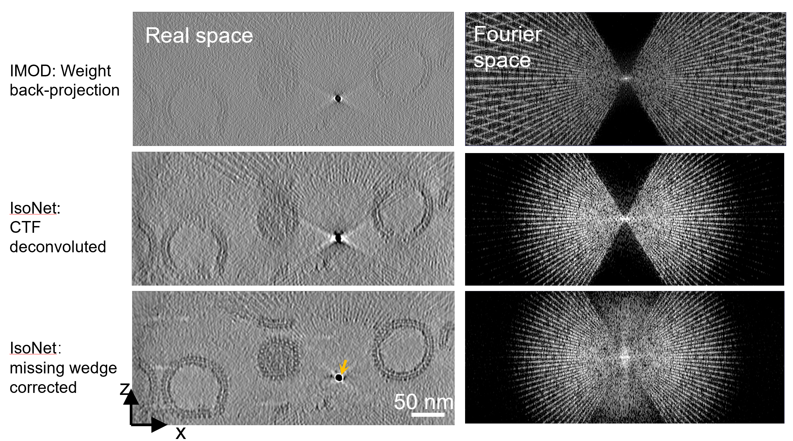 </p>


#### 2.1.1 Prepare tomograms and STAR file

First, create a folder for your project. In this folder, create
subfolder (in this case subfolder name is tomoset) and move all tomogram
(with suffix .mrc or .rec) to the subfolder.

``` {.bash language="bash"}
mkdir tomoset
mv TS*.rec tomoset/
```

Then run the following command in your project folder to generate a
tomogram.star file (in this example, the name of tomogram.star file is
hiv_tomo.star)

``` {.bash language="bash"}
isonet.py prepare_star tomoset --output_star hiv_tomo.star --pixel_size 10.8
```

If you are not using GUI, please use your favorite text editor, such as
vi or gedit, to open the **hiv_tomo.star**, and enter one defocus value
for each tomogram in the fourth column. This value should be the approximate
defocus value calculated for the 0-degree tilt images in angstrom. After
editing, your star file should look as follows. Note, this value is
only for CTF deconvolution, if you want to skip CTF deconvolution step,
leave this column as default 0.

``` {.bash language="bash"}
data_

loop_
_rlnIndex #1
_rlnMicrographName #2
_rlnPixelSize #3
_rlnDefocus #4
_rlnNumberSubtomo #5
1       tomoset/TS01-wbp.rec    10.800000       38838.257812    100
2       tomoset/TS43-wbp.rec    10.800000       25292.275391    100
3       tomoset/TS45-wbp.rec    10.800000       30169.785156    100
```

#### 2.1.2 CTF Deconvolve

This step not only reduces the CTF artifact but also enhances the low
resolution signal making training easier. This step is optional and can
not be performed for tomograms acquired with phase plate.

Type the following command in the terminal in your project folder. It
will generate deconvolved tomograms in **hiv_deconv** folder.

``` {.bash language="bash"}
isonet.py deconv hiv_tomo.star --snrfalloff 0.7 --deconv_folder hiv_deconv
```

If the command runs successfully, you will get the following terminal
output:

``` {.bash language="bash"}
######Isonet starts ctf deconvolve######

tomoset/TS01-wbp.rec angpix: 10.8 defocus 3.8838257812 snrfalloff 0.7 deconvstrength 1.0
deconvolved map is saved as  hiv_deconv/TS01-wbp.rec
time consumed:  14.191490888595581

tomoset/TS43-wbp.rec angpix: 10.8 defocus 2.5292275391 snrfalloff 0.7 deconvstrength 1.0
deconvolved map is saved as  hiv_deconv/TS01-wbp.rec
time consumed:  8.547893047332764

tomoset/TS45-wbp.rec angpix: 10.8 defocus 3.0169785156 snrfalloff 0.7 deconvstrength 1.0
deconvolved map is saved as  hiv_deconv/TS01-wbp.rec
time consumed:  8.76533579826355

######Isonet done ctf deconvolve######
```

#### 2.1.3 Generate Mask

To exclude the areas that are devoid of sample, we apply a binary sampling
mask to each tomogram. This step is optional but will improve the
efficiency of the network training.

By running the following command, 3D mask volumes for each tomogram will be
generated and stored in the **hiv_mask** folder. Default parameters will
give you a good enough mask.

``` {.bash language="bash"}
isonet.py make_mask hiv_tomo.star --mask_folder hiv_mask --density_percentage 50 --std_percentage 50
```

If this command works properly, you will find the mask file, when opened
with your favorite mrc image viewer such as 3dmod, covers the areas of
your sample of interest. Both this step and CTF deconvolve step will
modify your tomogram star file (**hiv_tomo.star**):

``` {.bash language="bash"}
data_

loop_
_rlnIndex #1
_rlnMicrographName #2
_rlnPixelSize #3
_rlnDefocus #4
_rlnNumberSubtomo #5
_rlnSnrFalloff #6
_rlnDeconvStrength #7
_rlnDeconvTomoName #8
_rlnMaskDensityPercentage #9
_rlnMaskStdPercentage #10
_rlnMaskName #11
1       tomoset/TS01-wbp.rec    10.800000       38838.257812    100     0.700000        1.000000        hiv_deconv/TS01-wbp.rec         50.000000    50.000000       hiv_mask/TS01-wbp_mask.mrc
2       tomoset/TS43-wbp.rec    10.800000       25292.275391    100     0.700000        1.000000        hiv_deconv/TS43-wbp.rec         50.000000    50.000000       hiv_mask/TS43-wbp_mask.mrc
3       tomoset/TS45-wbp.rec    10.800000       30169.785156    100     0.700000        1.000000        hiv_deconv/TS45-wbp.rec         50.000000    50.000000       hiv_mask/TS45-wbp_mask.mrc
```

#### 2.1.4 Extract Subtomograms

This step extracts small 3D volumes (here we also call subtomograms)
randomly from previously described tomograms or deconvoluted tomograms. If
you provide a mask in your tomogram star file, the center of the
subtomograms is inside the mask areas. The number of subtomograms to be
extracted in each tomogram is defined in the **\_rlnNumberSubtomo**
column in your tomogram star file. You can edit those as your desired
value. Usually, total of 300 subtomograms are sufficient for network
training.

The following command takes your tomogram star file as input and
Generates subtomograms in a folder named subtomo as well as a file named
subtomo.star

``` {.bash language="bash"}
isonet.py extract hiv_tomo.star
```

The subtomo.star contains information for your subtomograms.
**\_rlnCropSize** is the size of subtomograms, and **\_rlnCubeSize** is the
size actually used for network training, You can specify these values in
the *extract* command.


    data_
    
    loop_
    _rlnSubtomoIndex #1
    _rlnImageName #2
    _rlnCubeSize #3
    _rlnCropSize #4
    _rlnPixelSize #5
    1       subtomo/TS01-wbp_000000.mrc     64      96      10.800000
    2       subtomo/TS01-wbp_000001.mrc     64      96      10.800000
    3       subtomo/TS01-wbp_000002.mrc     64      96      10.800000
    4       subtomo/TS01-wbp_000003.mrc     64      96      10.800000
    5       subtomo/TS01-wbp_000004.mrc     64      96      10.800000
    6       subtomo/TS01-wbp_000005.mrc     64      96      10.800000
    7       subtomo/TS01-wbp_000006.mrc     64      96      10.800000
    8       subtomo/TS01-wbp_000007.mrc     64      96      10.800000
    9       subtomo/TS01-wbp_000008.mrc     64      96      10.800000
    10      subtomo/TS01-wbp_000009.mrc     64      96      10.800000
    11      subtomo/TS01-wbp_000010.mrc     64      96      10.800000
    12      subtomo/TS01-wbp_000011.mrc     64      96      10.800000

#### 2.1.5 Refine

The extracted sub-tomograms and subtomo star file are used as input in
this refine step, which iteratively trains networks that fill the
missing wedge information (and reduce noise). The output is defined by
**the result_dir** parameter, whose default value is \"results\". In this
folder, you will find all the subtomograms in each iteration as well as
the network model files with the extension of h5, if this command runs
successfully.

it will take about 10 hours for four Nvidia 1080Ti to finish the refine
step with the following command:

``` {.bash language="bash"}
isonet.py refine subtomo.star --gpuID 0,1,2,3 --iterations 30 --noise_start_iter 10,15,20,25 --noise_level 0.05,0.1,0.15,0.2 
```

Once you execute the refine step, you will get the command line output
as follows:

``` {.bash language="bash"}
######Isonet starts refining######

06-11 22:00:55, INFO     Done preperation for the first iteration!
06-11 22:00:55, INFO     Start Iteration1!
06-11 22:00:59, INFO     Noise Level:0.0
06-11 22:01:36, INFO     Done preparing subtomograms!
06-11 22:01:36, INFO     Start training!
06-11 22:01:38, INFO     Loaded model from disk
06-11 22:01:38, INFO     begin fitting
Epoch 1/10
112/112 [==============================] - 106s 944ms/step - loss: 0.1597 - mse: 0.0726 - mae: 0.1597 - val_loss: 0.1575 - val_mse: 0.0711 - val_mae: 0.1575
Epoch 2/10
112/112 [==============================] - 101s 897ms/step - loss: 0.1543 - mse: 0.0591 - mae: 0.1543 - val_loss: 0.1617 - val_mse: 0.0726 - val_mae: 0.1617
Epoch 3/10
112/112 [==============================] - 101s 904ms/step - loss: 0.1489 - mse: 0.0513 - mae: 0.1489 - val_loss: 0.1535 - val_mse: 0.0616 - val_mae: 0.1535
Epoch 4/10
112/112 [==============================] - 101s 903ms/step - loss: 0.1486 - mse: 0.0489 - mae: 0.1486 - val_loss: 0.1583 - val_mse: 0.0687 - val_mae: 0.1583
Epoch 5/10
112/112 [==============================] - 101s 905ms/step - loss: 0.1467 - mse: 0.0458 - mae: 0.1467 - val_loss: 0.1482 - val_mse: 0.0478 - val_mae: 0.1482
Epoch 6/10
112/112 [==============================] - 102s 906ms/step - loss: 0.1449 - mse: 0.0442 - mae: 0.1449 - val_loss: 0.1472 - val_mse: 0.0487 - val_mae: 0.1472
Epoch 7/10
112/112 [==============================] - 102s 906ms/step - loss: 0.1430 - mse: 0.0409 - mae: 0.1430 - val_loss: 0.1410 - val_mse: 0.0411 - val_mae: 0.1410
Epoch 8/10
112/112 [==============================] - 102s 908ms/step - loss: 0.1437 - mse: 0.0408 - mae: 0.1437 - val_loss: 0.1427 - val_mse: 0.0437 - val_mae: 0.1427
Epoch 9/10
112/112 [==============================] - 102s 909ms/step - loss: 0.1413 - mse: 0.0393 - mae: 0.1413 - val_loss: 0.1415 - val_mse: 0.0387 - val_mae: 0.1415
Epoch 10/10
112/112 [==============================] - 102s 910ms/step - loss: 0.1406 - mse: 0.0383 - mae: 0.1406 - val_loss: 0.1430 - val_mse: 0.0399 - val_mae: 0.1430
06-11 22:21:04, INFO     Done training!
06-11 22:21:04, INFO     Start predicting subtomograms!
06-11 22:22:53, INFO     Done predicting subtomograms!
06-11 22:22:53, INFO     Done Iteration1!
06-11 22:22:53, INFO     Start Iteration2!
```

You can also continue from the pretrained model for this dataset
provided in the link. The following command will use the pre-trained
network model as the model of 1st iteration, then predict subtomos and
train networks starting from this model.:

``` {.bash language="bash"}
isonet.py refine subtomo.star --pretrained_model ./pretrained_model.h5  --gpuID 0,1,2,3 
```

Another option is to continues from previous runs, with
**continue_from** command. This option allows reading the parameter from
previous iteration in '.json' file and continuing from that. For example:

``` {.bash language="bash"}
isonet.py refine subtomo.star --continue_from results/refine_iter20.json  --gpuID 0,1,2,3 
```

#### 2.1.6 Predict

During the refinement step, the network models are saved in **result_dir**
folder. You can select one and apply it to your entire tomograms in the
tomogram star file. For example:

    isonet.py predict tomograms.star ./results/model_iter40.h5 --gpuID 0,1,2,3

This process may take a few minutes to predict all tomograms in the
tutorial dataset. You can also use **tomo_idx** to tell the program which tomogram(s) you want to predict.

Now, We now the missing wedge corrected tomograms in the corrected_tomos folder.

### 2.2 IsoNet for Cellular tomography
 [Here](./Example1.md) missing wedege correction and denoising for a tomogram of a neuronal synapse. This synapse dataset is a acquired with volta phase plate, thus CTF deconvolution step is not performed.

<p align="center">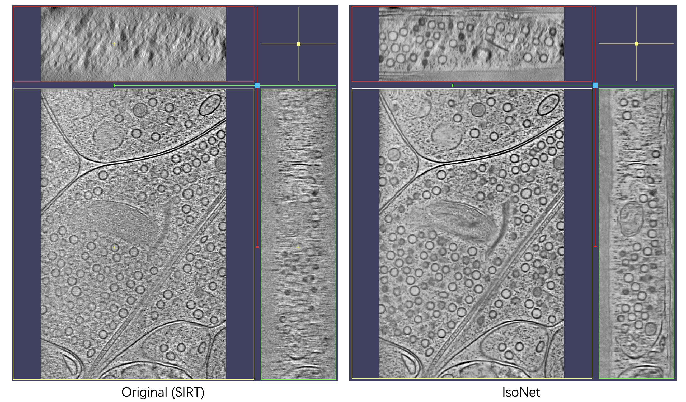 </p>


This example processes tomogram of **synapse structure** through **IsoNet**.

#### 2.2.1 Run IsoNet from command line

Prepare working directory like following; Data used for demonstration can be found here

```
isonet_demo/
└── tomofile
    └── pp676-bin4-5i-demo.rec
```

1. Prepare STAR file

command line:

```
isonet.py prepare_star tomofile/ --pixel_size 18.12 --number_subtomos 300
```

The default file name of STAR file will *tomograms.star* ; Contents in this file can be modified through text editors.

2. Deconvolution

This step is not necessary for tomograms acquired with a phase plate.

3. Generate mask

To exclude the areas that are devoid of sample, we apply a binary sampling mask to each tomogram. This step will improve the quality of the training dataset. Since this demo tomogram has a bin-factor of 4, a smaller Gaussian filter can smooth out noise and keep the fine structure. We set *patch_size* to 2. Usually, the top and bottom (along the z-axis) regions are lack of content. We mask out the top 15% and bottom 15% region by setting *z_crop* to 0.15.

```bash
isonet.py make_mask tomograms.star --z_crop 0.15 --patch_size 2
```

The output mask will be placed in the **mask** by default.

4. Extract subtomogram

This step extracts small volumes (here we also call subtomograms) from big tomograms, with the sampling mask generated in the previous step.

```
isonet.py extract tomograms.star
```

The default subtomogram folder is **subtomo**. And **subtomo.star** file is the corresponding STAR file of subtomograms.

Up to this step, our workspace is like this:

```
isonet_demo/
├── mask
│   └── pp676-bin4-5i-demo_mask.mrc
├── subtomo
│   ├── pp676-bin4-5i-demo_000000.mrc
│   ├── pp676-bin4-5i-demo_000001.mrc
│   ├── pp676-bin4-5i-demo_000002.mrc
│   ├── pp676-bin4-5i-demo_000003.mrc
		.
		.
		.
│   ├── pp676-bin4-5i-demo_000298.mrc
│   └── pp676-bin4-5i-demo_000299.mrc
├── subtomo.star
├── tomofile
│   └── pp676-bin4-5i-demo.rec
└── tomograms.star
```

5. Refine

This process iteratively fills the missing wedge information by training deep neural networks with subtomograms. The default refinement parameters are great for most cellular tomograms. Here, we only set the ID of GPU and the results directory name where the neural network models are saved during iterative refinement.

```
isonet.py refine subtomo.star --gpuID 0,1 --result_dir demo_results
```

The training time depends on the GPU performance. This example takes **7 hours** on two Nvidia gtx1080 cards for 25 iterations.

6. Predict

All trained neural-net models after each iteration are stored in the results directory (**demo_results** in this example ). Predict will employ one of these models (typically, those models after 25-30 iterations, corresponding to denoise levels between 0.15-0.20) to do missing wedge correction to the original tomogram (pp676-bin4-5i-demo_mask.mrc). In this demonstration, we use the model after 25 iterations.

```bash
isonet.py predict tomograms.star demo_results/model_iter25.h5 --gpuID 0,1
```

The prediction time consumption is much less than the refinement step. This tomogram will take less than **2 minutes** to predict using two Nvidia gtx1080 cards.


#### 2.2.2 Run IsoNet with GUI

Open a terminal window, type the following to launch the GUI

```
isonet.py gui &
```

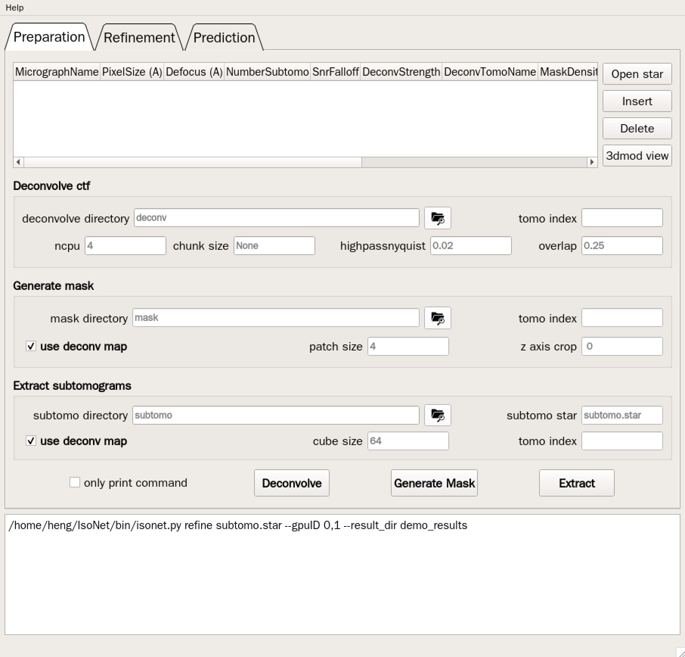

1. Add tomograms

Click *insert* on the upper-right panel and then click *None* in the *MicrographName* column, select one tomogram.

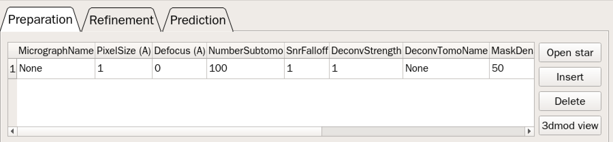

Set the pixel size and the number of subtomogram to be extracted from this tomogram.

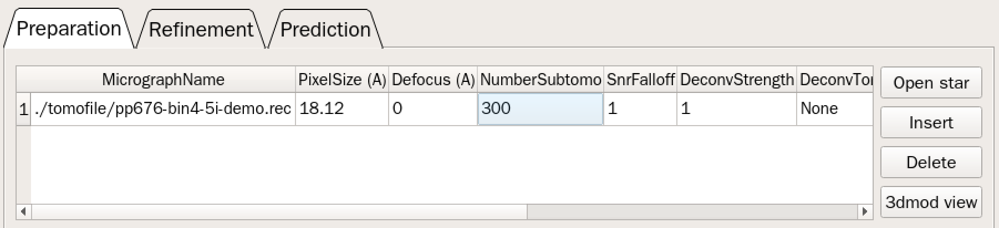

2. Generate mask

Set proper parameters for producing mask.

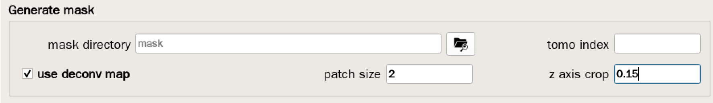


And click **Generate Mask** button.


We can view the produced mask via 3dmod: Click the small index  '1'  at the beginning of the row in the tomogram table and click **3dmod view**

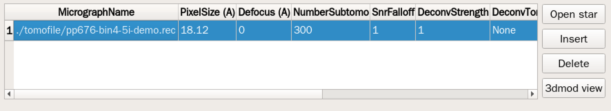

Check the mask you generate and adjust the parameter if necessary.

3. Extract subtomogram

Click **Extract**

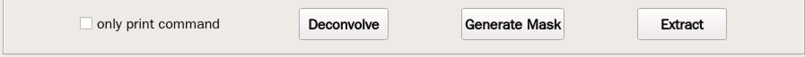

4. Refinement

Click the **Refinement** tab at the uppermost panel and set the GPU ID and results folder name.

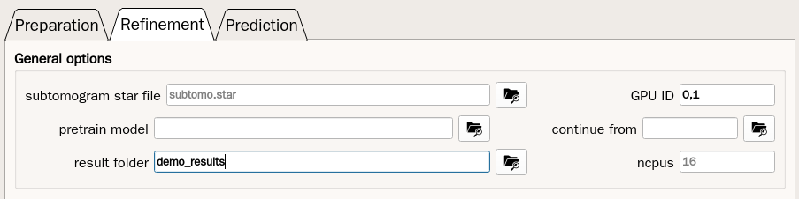

Click **Refine** button below to start iterative refinement.

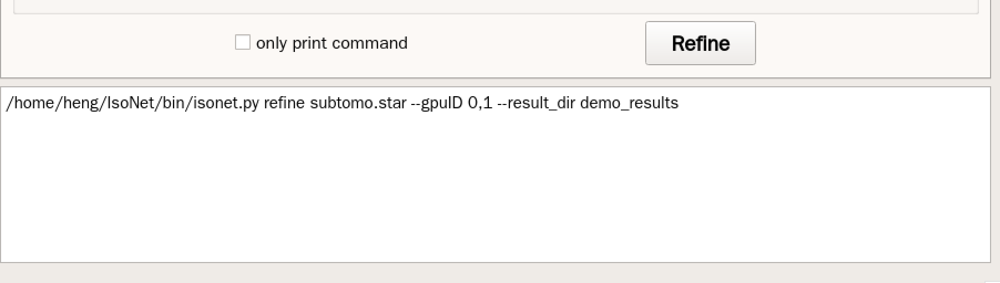

If you want to run the refinement step on a remote machine or cluster using command-line, you can check the 'only print command ' box. Then when you click **Refine** button, the command for refinement will output to your terminal window.

5. Predict

Click the **Prediction** tab at the uppermost panel.

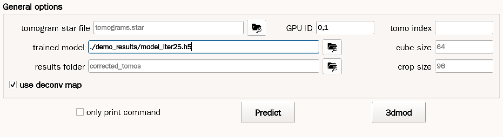

Specify the GPU and choose the model for prediction. Click **Predict** to star predicting.

You can view the missing wedge corrected tomogram by clicking **3dmod**. 


## 3 Individual tasks
This chapter is a detailed description of each command. Among those commands, refine and predict are computational extensive and require GPU acceleration.
### 3.1 Prepare tomograms and STAR file

IsoNet uses star file format to store information of tomograms. This file can be prepared using **isonet.py prepare_star** command prior to subsequent processing. To do so, users should prepare a folder containing all tomograms. 
Binning the tomograms to pixel size of more than 10 A is recommended since the target z-axis resolution should be about
30A. Too large (>25A) or too small (<5A) pixels might reduce the efficiency of IsoNet network training. The default **pixel_size** parameter is 10A. We typically use a folder containing 1 to 5 tomograms as input.

&emsp; Input tomograms can be either reconstructed by SIRT or WBP algorithm. The tilt axis should be y-axis and recommended tilt range is from -60 to 60 degrees, without x-axis tilt, while other tilt ranges might also work. The tilt series can be collected with any tilt schemes, continuous, bidirectional or dose-symmetric.

&emsp;If you do not want to perform CTF deconvolution, especially when the tomogram is acquired by phase plate or the tomogram is already CTF corrected, the **defocus** for that tomogram in star file can be left as 0. Otherwise, you can use the **defocus** parameter to set one defocus value for the tomograms. This value should be the defocus value of the zero tilt image. We do not consider defocus variation across different tilted images in this version of IsoNet, since IsoNet is not optimized for high-resolution reconstruction currently. 

 &nbsp; When you have multiple tomograms in the folder, the **defocus** parameter (in angstrom) for each tomogram should be adjusted in the star file with your text editor (or in IsoNet GUI), after the tomogram star file has been generated with **isonet.py prepare_star** command.

### 3.2 CTF deconvolve

Given the defocus values in the tomogram star file, CTF deconvolution can be performed by applying a Weiner filter to each tomogram. This step is similar to the CTF deconvolve in the software Warp. It not only reduces the CTF artifact but also enhances the low-resolution signal to train the network more easily. This step can be skipped for tomograms acquired with a phase plate. 

Two parameters, **snrfalloff** and **deconvstrength**, are worthy to be tuned in this step to enhance visual contrast of the tomograms. If these parameters are not set in the command, the values in the *star* file will be used; If the star file does not contain these parameters, default 1.0 will be used for both parameters. 
&nbsp; The effect of these two parameters is shown in the following figures. You can also specify **tomo_index** (e.g. 1,3-4 ) so that only the specific tomogram or tomograms will be processed. Another parameter **hipassnyquest** applies a high pass filter at very low frequency, changing this
parameter might be helpful if the tomograms become too blurry. 


<p align="center">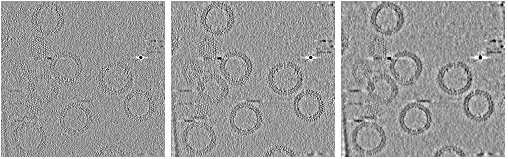 </p>

<p style="text-align: center; font-size: 11pt"> 2D slices of CTF deconvolved tomograms with different deconvstrength parameters. 
			Left: deconvstrength=0.5; middle: deconvstrength=1;right:deconvstrength=1.5 </p>

<p align="center"> 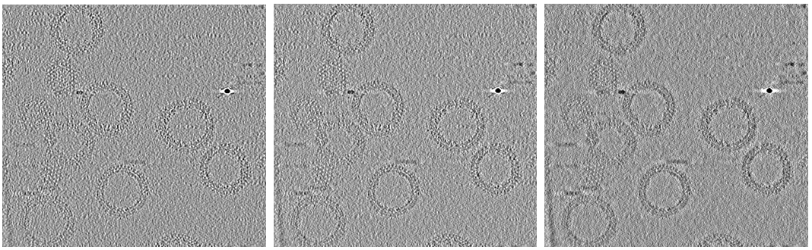 </p>

<p style="text-align: center; font-size: 11pt"> 2D slices of CTF deconvolved tomograms with different snrfalloff parameters. Left: snrfalloff=0.5; middle: snrfalloff=1;right:snrfalloff=1.5

Multiple CPUs can be used for CTF deconvolution, the number of CPUs is given by the parameter **ncpu**, with a default value of 4.

When your computer has enough memory, keep **chunk_size** None. Otherwise, You can let the IsoNet program crop the tomogram into multiple chunks for multiprocessing and assemble them into one. The **chunk_size** defines the size of an individual chunk. This option may induce artifacts along the edges of chunks. When that happens, you may try a larger **overlap_rate**.

### 3.3 Generate mask

To obtain a training dataset, sub-tomograms are randomly extracted from tomograms. However, when the sample in a given tomogram is sparsely distributed, most of the extracted sub-tomograms will not contain meaningful information. Therefore, the performance of network training might be reduced, although in most cases, you can still get a reasonable
result from training without masks.

To help with getting a more meaningful training dataset, we introduce the
**make_mask** module, which created three types of mask: 

1. Pixel intensity mask
2. Standard deviation mask
3. User defined polygon mask

The final mask created by the command is the **intersection** of these three types of masks.

#### 3.3.1 Pixel intensity mask

This type of mask will mask out empty areas that have relatively low local poxel density. It will first suppress noise with a 3D Gaussian filter and then apply a 3D sliding window maximum-density filter to the tomograms. The window size of the maximum filter is defined by **patch_size** parameter. This size can be increased if the tomograms are too noisy.

In this filter tomogram, the areas with relatively smaller density values will be deemed as empty space and can be excluded with parameter **density_percentage**, ranging from 0 to 100, meaning the only include this percentage of pixels in the mask.

Usually, a lower **density_percentage** value should be used when tomograms have sparsely distributed samples. This type of mask does not work well when the tomograms do not have uniform backgrounds, e.g. darker on one side of the tomogram. When you don't want to use this mask, set the **density_percentage** value to 100.

#### 3.3.2 Standard deviation mask

Recognizing that the \"empty\" regions of the tomograms are often areas with low standard deviation (STD), this standard deviation mask is designed to exclude the low STD areas.

To do so, we calculated the STD of a volume centered at the evaluating pixel (local STD). The size of the volume to measure local STD is defined by the parameter **patch_size**, this parameter is also used to define the size of max filter in pixel intensity mask.

Pixels with STD ratio larger than the **std_percentage**% of all pixels will be included in the mask. When you don't want to use this mask, set the **std_percentage** value to 100.

<p align="center"> 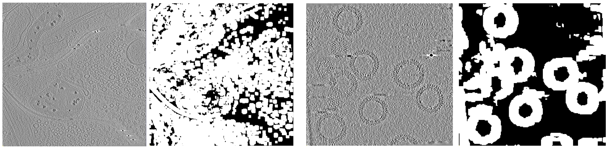 </p>

<p style="text-align: center; font-size: 11pt">XY slices of tomograms and corresponding masks. Both using density_percentile=50 and std_percentile=50 </p>


#### 3.3.3 Draw a polygon to define area of interest

This option is new in version 0.2. The polygon should be drawn in 3dmod (a command in IMOD). The polygon file (with extension .mod) corresponds to the **MaskBoundary** parameter in star file, or the table in graphic user interaface (GUI). This option is espacially useful to find carbon areas that can not detecte with the above two types of masks.

To generate polygon mask in GUI, first click **3dmod view** to open a tomogram file. 

Select **model** mode in the 3dmod window. Then click few points on tomograms to make a polygon (This mouse buttom assignment can be set in 3dmod perference).

<p align="center"> 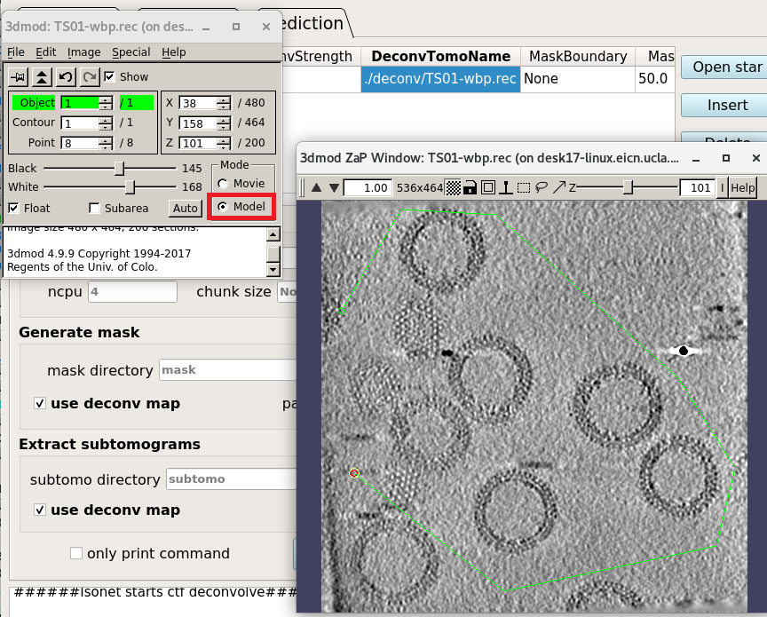 </p>

<p style="text-align: center; font-size: 11pt">Draw polygon with 3dmod </p>

Optionaly, after you created a polygon, you can click one point on the top and bottom slices each to define z range of the mask.

Then save the polygon to a file (with .mod extension) and double click the corresponding field of MaskBoundary in the GUI table to load the imod model file. Then execute **make mask** button, the generated mask will exclude areas outside polygon.

<p align="center"> 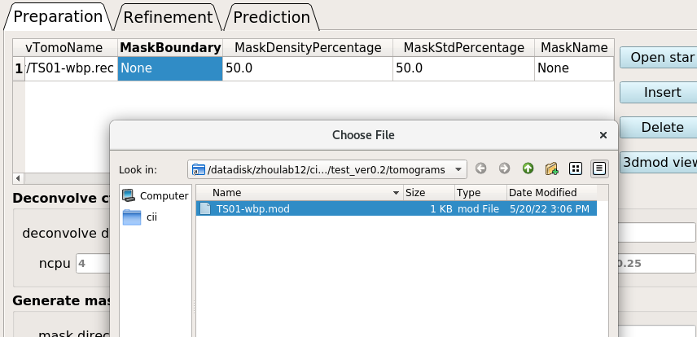 </p>

<p style="text-align: center; font-size: 11pt">Double clock the selected field and load the imod model file </p>


<p align="center"> 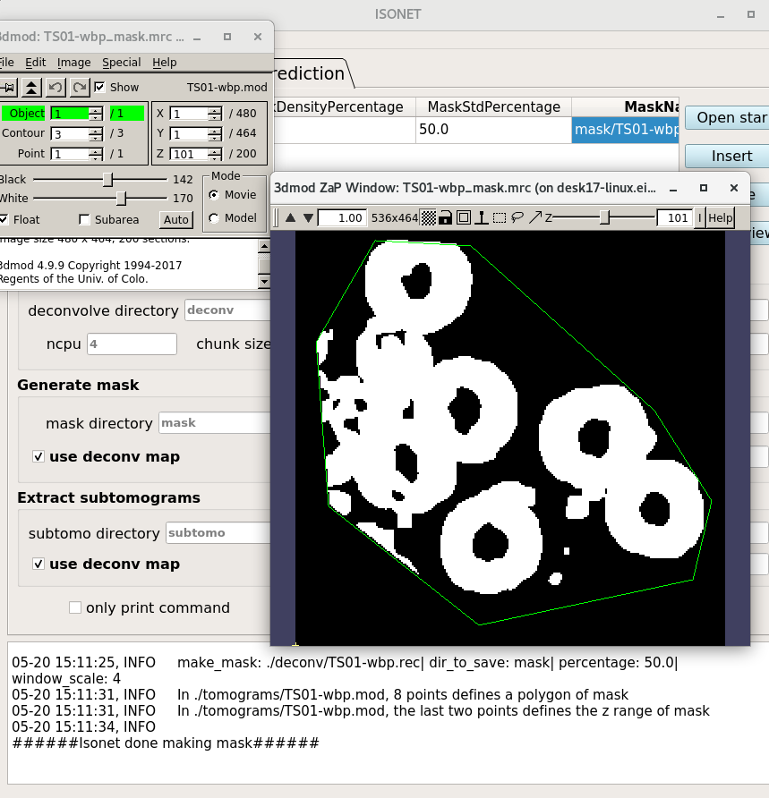 </p>

<p style="text-align: center; font-size: 11pt">Mask generated with user defined polygon </p>

Note: To create mask boundary with command line and **without** GUI. You should modify mask boundary column in the tomogram star file, then run **isonet.py make_mask tomograms.star**. The modified star file should look like follows:


```
data_

loop_
_rlnIndex #1
_rlnMicrographName #2
_rlnPixelSize #3
_rlnDefocus #4
_rlnNumberSubtomo #5
_rlnSnrFalloff #6
_rlnDeconvStrength #7
_rlnDeconvTomoName #8
_rlnMaskBoundary #9
_rlnMaskDensityPercentage #10
_rlnMaskStdPercentage #11
1       ./tomograms/TS01-wbp.rec        10.880000       38838.000000    100     1.000000        1.000000        ./deconv/TS01-wbp.rec   ./tomograms/TS01-wbp.mod        50.000000       50.000000 
```

If you want only define z range instead of making polyson. you can simply click two points on the tomograms to define z range. Or specify the **z_crop** parameter. For example, **\--z_crop 0.2** will mask out both the top 20% and bottom 20% region along the z-axis.


### 3.4. Extract
#### 3.4.1 Extract from tomograms
This step randomly extracts the subtomograms from tomograms listed in the input tomogram star file. The output of this command is a folder containing all the subtomograms and a star file containing the information of those subtomograms.

The number of subtomograms to be extracted for each tomogram should be written in the tomogram star file in the column of (\_rlnNumberSubtomo). Users can modify this number in the star file. Ideally, the smaller the masked area, the smaller this number should be. Usually total 300 subtomograms are sufficient for IsoNet refine.

If mask files are provided in the input tomogram star file, the centers of the subtomograms are always inside the mask regions. If CTF deconvoluted tomograms are provided in the tomogram file, those
tomograms will be used for the subtomogram extraction unless the
**use_deconv_tomo** parameter is set to False.

The parameter **cube_size** is the size of the cubic volume for
training, not the size of extracted subtomograms. The actual size of the extracted subtomograms, which is defined as **crop_size**, is by default 16 + cube_size. The **cube_size** should be divisible by 8 and is usually limited by the GPU memory. 64 or 96 is often a good estimation for **cube_size**. If you encountered
an out-of-memory (OOM) problem during network training, reducing this value is one of the choices.


#### 3.4.2 Prepare *star* file from subtomograms

This step is not in the main workflow of IsoNet, but might be helpful if you already have subtomograms extracted through other softwares. For example, if you are only interested in processing subtomograms of a particular protein, you can manually pick and extract them, then prepare star file with this command. We also recommend these subtomograms are downing-scaled to >10 A/pixel and CTF deconvoluted if those are not acquired with phase plate.


This step generates a *star* file from a folder containing only subtomogram files. The subtomogram files should be in mrc format, with extension of \".mrc\". The generated star file can be used as input for refine.


This command works as follows, where \"folder_name\" is the folder containing subtomograms:

``` {.bash language="bash"}
isonet.py prepare_subtomo_star folder_name [--output_star] [--cube_size] 
```

The default output star file is **subtomo.star**. **cube_size** is the size of the cubic volumes used for training. This value should be smaller than the size of subtomograms and should be divisible by 8, eg. 64, 96. If this value isn't set, **cube_size** is automatically determined as int(subtomo_size / 1.5 + 1)//16 \* 16

### 3.5 Refine

This process iteratively trains neural networks to fill the missing
wedge information using the same tomograms whose missing wedge artifacts were added to other directions. The denoising module can also be enabled in this step, making the network capable of both reducing noise and Recovering missing wedge. After refine, the neural network model in each iteration are saved in the results folder. The network models with suffix of \".h5\" can be used for the prediction step.

#### 3.5.1 Computation resources

At the beginning of each iteration, IsoNet will process the
subtomograms, such as rotating, cropping, and applying missing wedge filter. Only CPUs are used for those processes. The parameter
**preprocessing_ncpus** is used to define how many CPU cores are used for this preparation step.

Users have to specify **gpuID**, e.g. 0,1,2,3, for the network training, so that 3D volumes will be distributed across those GPUs. Information of available GPUs can be found through the command: *nvidia-smi*. In general, using more GPUs reduces GPU memory requirement for each GPU and current network training can not be performed across multiple computer machines.

The **data_dir** is the folder that temporally stores the training
and test data pairs. The files in that folder will be updated every
iteration. Setting it to a faster drive such as SSD or memory file
system will presumably increase the speed of network training, though not fully bench-marked on the developer's side.

#### 3.5.2 Optimizing training speed

One **iteration** of refinement contains three steps: training data
preparation, network training, and subtomogram prediction. The model will be refined iteratively based on previous prediction results. In practice, a total of 10 to 20 iterations is typically used for refinement without denoising. Please refer to the denoising section for more details.

The training step is divided into several **epochs**. Each epoch will traverse through the randomly shuffled data set. The default value(10) for the number of epochs is usually sufficient. Training data pairs are grouped into batches to feed into each epoch. The **batch_size** should be divisible by the number of GPUs so that the data can be distributed into multiple GPUs. If you are using multiple GPUs and **batch_size** is not set, the default value is two times the number of GPUs. If you are using a single GPU, the default **batch_size** is four. We tested **batch_size** of 4-12 can result in a good performance, too large **batch_size** might lead to out of memory (OOM) error. **steps_per_epoch** defines how many batches are to be processed in one epoch. A value between 100 to 300 are recommended. If this value is not set by the user, the default **steps_per_epoch** is min(number_of_subtomograms \* 6 / batch_size , 200)

#### 3.5.3 Denoising

The **noise_start_iter** parameter defines when denoising will be applied during the refine. 

Usually, this parameter is set to be the iteration in which undenoised training converged. 

The **noise_level** is the ratio of the standard deviation of the additive noise compare to that of the original
data. Once the denoise was applied, the mean absolute error loss of the training will be increased. 

If the **noise_level** is too high, the training might fail, as indicated by the extremely large losses.

You can set both **noise_start_iter** and **noise_level** with multiple
values. So that you can gradually increase the **noise_level** during
the training. 

For example, in the following command, the **iteration** parameter is
set to 30, **noise_level** is set to 0.1,0.2, and **noise_start_iter**
is 11,21. Then the first 10 iterations are trained without denoising,
11-20 iterations are trained with noise level 0.1, 21-30 iterations are
trained with noise level 0.2. You can use the neural network model from
iteration 10, 20, 30 to predict the same tomogram and distinguish which
level of denoising is best for your tomograms.

``` {.bash language="bash"}
isonet.py refine subtomo.star --iter 30 --noise_level 0.1,0.2 --noise_start_iter 11,21
```

#### 3.5.4 Network structure

IsoNet allows users to modify the network structures by the input arguments. For example, it might be useful to increase or decrease the
size of the network by increasing or decreasing **unet_depth**, though this is
not recommended unless users want to test the performance of
different networks. 


Another parameter that decides the complexity of the neural network is **filter_base**. It determines the scale of the number of feature channels and has been set to 64 by defaults. Increasing it could lead to a better result at the cost of a longer training time. Please note that parameters defining network structure will be ignored when using **pretrained_model** of **continue_from**.

If **normalize_percentile** is set True, tomograms will be normalized by
percentile, which scales the sub-tomograms in a range approximately from
0 to 1. If this is set False, the sub-tomograms will be normalized to
have a mean of zero and a standard deviation of 1.

#### 3.5.5 Continuing using the previously trained network

If you want to continue with a model from previous iterations of refine,
you can specify the **continue_from** argument, which takes the '.json'
file that is generated at each iteration.

For example:

``` {.bash language="bash"}
isonet.py refine subtomo.star --continue_from ./results/refine_iter30.json --gpuID 0,1,2,3 --iterations 50 
```

If you already have a trained network model (with a file extension of
.h5), instead of '.json' file , you may want to choose
**pretrained_model** option:

For example:

``` {.bash language="bash"}
isonet.py refine subtomo.star --pretrained_model ./pretrained_model.h5 --gpuID 0,1,2,3 
```

This command enables using your pretrained model to predict the
subtomograms of the first iteration. Starting with the second iteration,
you are refining this model using the subtomograms in the subtomo.star

### 3.6 Predict

This module applies the trained network model to tomograms to restore
the information in the missing wedge region of tomograms. It takes the
tomogram star file, which can be generated with **isonet.py prepare_star** command, and a trained network model (with .h5 file
extension) as input. The input tomograms in the tomogram star file are
typically the exact tomograms used for training or other tomograms with
similar sample and imaging conditions. If the network is trained with
CTF deconvolved tomograms, the tomograms used for predict should also be
CTF deconvolved.

This step is much faster than refine step. **gpuID** defines which
GPU(s) will be used for predicting, e.g. 0,1,2,3. If this parameter is
not set, CPU will be used for prediction, which could take much longer
time than using GPU.

To fit the tomogram into the GPU memory, one tomogram is divided into
multiple tiles for the missing wedge correction and the overlap
tile strategy is used to prevent the artifact during montaging the tiles. To
implement this strategy, the **crop_size** should be larger than the
**cube_size**. The **cube_size** and **crop_size** are suggested to be
consistent with the training settings. If **crop_size** is not large
enough, you may observe artifacts of grids between the adjacent tiles.


The **batch_size** defines the number of subtomograms grouped
together for network predicting, this value should be divisible by the
number of GPU. Larger **batch_size** will save more predicting time but
occupy larger your GPU memory. **normalize_percentile** should be the
same as that parameter in refine.

``` {.bash language="bash"}
isonet.py predict tomogram.star path_to_network_model --gpuID 0,1,2,3 --cube_size 80 --crop_size 128
```


## 4 GUI

This section briefly described IsoNet graphic user interface (GUI). You
can watch our [tutorial video](https://drive.google.com/drive/folders/1DXjIsz6-EiQm7mBMuMHHwdZErZ_bXAgp) for the details on how to use GUI.

The GUI can be started by the following command:

``` {.bash language="bash"}
isonet.py gui
```

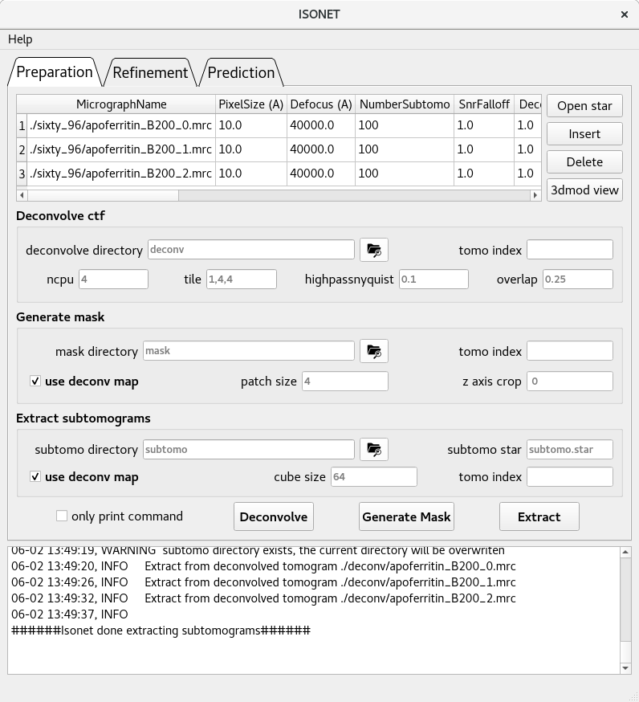

This software mainly have 3 pages, they are **Preparation**,
**Refinement** and **Prediction**.

1.  Preparation includes the preprocessing steps to prepare the dataset to
    be trained in the later Refinement step.
    -   Deconvolve CTF: Correct CTF and increase the contrast of tomograms.

    -   Generate mask: create mask to define the region of interest in the tomograms

    -   Subtomograms extraction: generate the training dataset

2.  Refinement trains a neural network to correct the missing-wedge.

3. Prediction generates corrected tomograms based on the trained model from the Refinement step.

The GUI will automatically read the **tomograms.star** as default if it exists in the current folder.

In the preparation tab, an input table allows users to create or load **.star** file. You can click insert to add a new row into the table. For
tutorial dataset, you need to specify MicrographName
(reconstructed tomogram), pixel size, estimated defocus value for the tomogram's 0 degree image. You can select an entire row by clicking the index of the row on
the left-most region. After being selected, you can duplicate it or delete it
by clicking the insert or Delete button on the right. '3dmod view' helps
users to visualize selected tomograms and/or masks.

Further operations of IsoNet GUI are intuitive. Please refer to the [video tutorial](https://drive.google.com/drive/folders/1DXjIsz6-EiQm7mBMuMHHwdZErZ_bXAgp) or the [first example](Example1.md).


